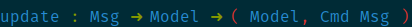

# elm-extra-conceals
This plugin adds extra conceals for the elm programming language.

## Installation
For vim-plug:

```vim
Plug 'groteck/vim-elm-conceals', { 'for': 'elm' }
```

For dein.vim:

```vim
call dein#add('groteck/vim-elm-conceals')
```

For manual installation(not recommended):

Extract the files and put them in your Neovim or .vim directory (usually $XDG_CONFIG_HOME/nvim/).

## Configuration
You can disable this plugin with:

```vim
let g:disable_elm_conceal=1
```

## Screenshots

Arrow conceal ->:



Pipe forward conceal |>:


Pipe backward conceal <|:


Composition forward conceal >>:


Composition backward conceal <<:


